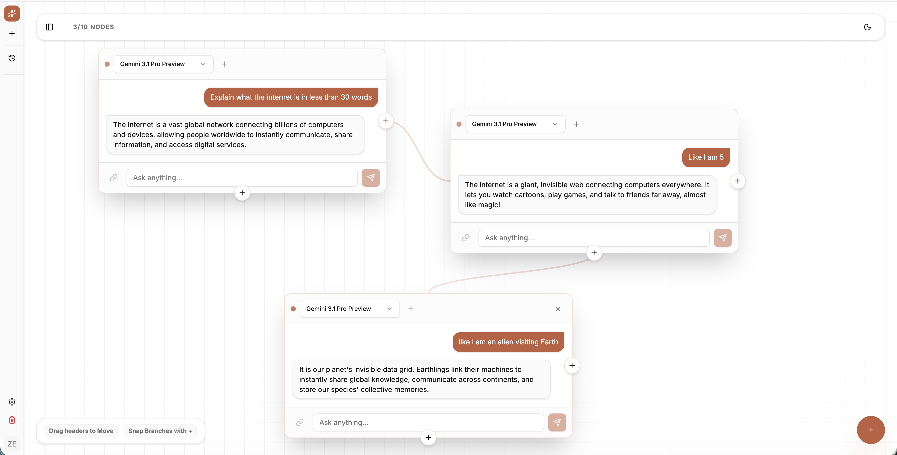
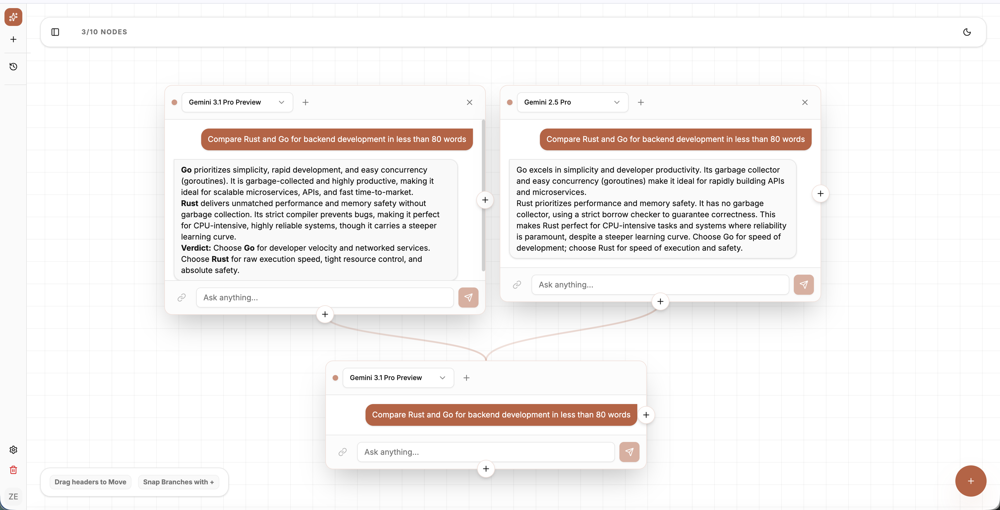
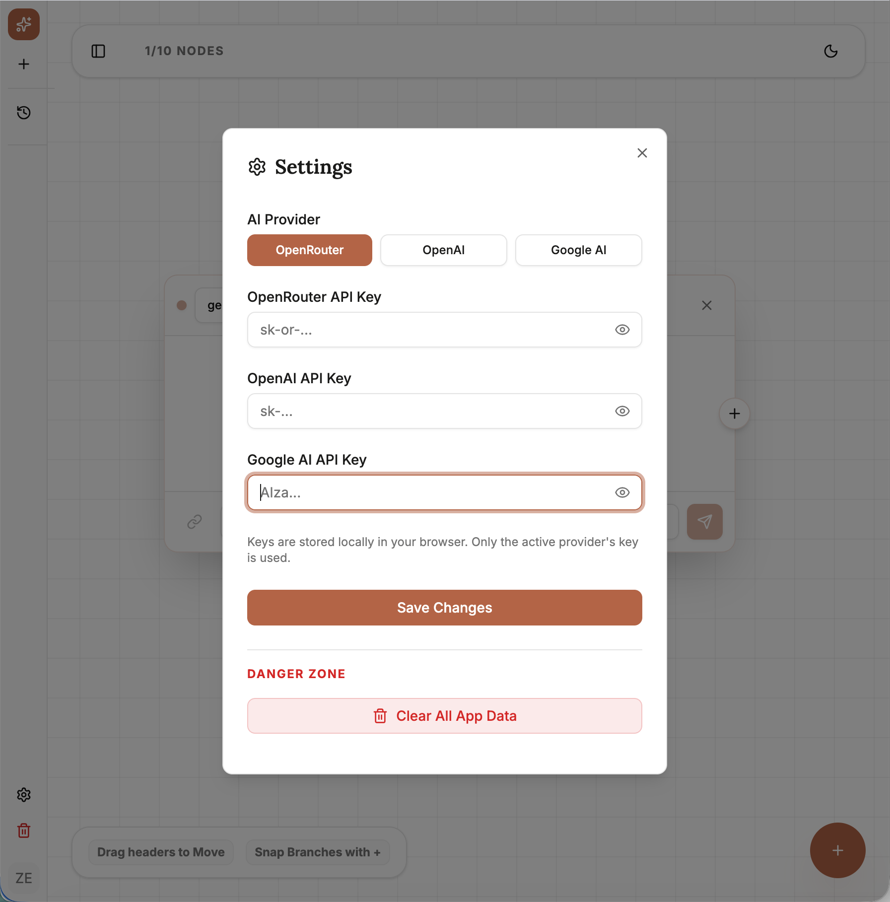

# Canvas AI

[](https://github.com/zendegani/canvas-chatbot/actions/workflows/node.js.yml)

[](https://github.com/zendegani/canvas-chatbot/blob/main/LICENSE)

**A next-generation infinite canvas for non-linear AI conversations.**

Canvas AI allows you to break free from linear chat threads. Visualize your thoughts, branch conversations, and orchestrate multiple AI models on a single, infinite spatial interface.

## Features

- **Infinite Canvas**: Pan, scroll, and organize your thoughts spatially. No more getting lost in long, vertical history.
- **Chat History & Sidebar**: A sleek, collapsible sidebar lets you seamlessly switch between, manage, and autosave up to 50 previous conversations.
- **Branching Conversations**: Want to explore a tangent? Branch off any message node to create a new thread without losing context.

  

- **Model Duel**: Pick *multiple* models at once to split-test a prompt side-by-side, and visually merge their results together.

  

- **Web search (Tavily)**: Toggle the globe icon on any node to let the model search the web mid-conversation. Tool calls are visible in tracing and the model can chain multiple searches per turn.
- **Stop generating**: Cancel an in-flight response from any node with the Stop button. Partial output is preserved.
- **Observability via Arize Phoenix**: Optional one-click local tracing of every LLM call — prompts, completions, tool calls, latency, token counts, and reasoning. Configure the collector in Settings → Tracing; spin up Phoenix locally with `npm run phoenix:up`.
- **Local & Secure**:
  - **Bring Your Own Key**: You typically use your own OpenRouter, OpenAI, Google, or MiniMax API keys.

    

  - **Local Storage**: Your chat history is stored **only** in your browser's local storage.
  - **Authentication**: Powered by **Better Auth**, featuring robust local session management backed by PostgreSQL/Prisma, and rigorous NIST 800-63B password validation.
  - **Session Isolation**: Multiple users can share a device safely; data and chat histories are scoped to your login session.
- **System-aware theme**: Light / dark / system tri-state toggle. Manual overrides auto-revert to system preference after 5 hours so an evening dark mode doesn't outlast the morning.

## Getting Started

### Prerequisites

- Node.js (v16 or higher)
- npm or yarn
- Vercel CLI (install via `npm i -g vercel`)
- An API Key from OpenRouter, OpenAI, Google, or MiniMax
- *(Optional)* A Tavily API key for web-search tool calls — get one at [tavily.com](https://tavily.com)
- *(Optional)* Docker, to run Arize Phoenix locally for tracing

### Installation

1. **Clone the repository**

    ```bash
    git clone https://github.com/zendegani/canvas-chatbot.git
    cd canvas-chatbot
    ```

2. **Install dependencies**

    ```bash
    npm install
    ```

3. **Run the development server**

    ```bash
    vercel dev
    ```

    The app will start locally. Vercel CLI will typically start the app at `http://localhost:3000`.

### Usage Guide

1. **Sign Up**: Create a local account.
2. **Configure providers**: Open **Settings → LLM Providers** and paste API keys for any of OpenRouter, OpenAI, Google, or MiniMax. MiniMax also needs a Group ID (found on `platform.minimax.io` → basic information).
3. **(Optional) Enable web search**: Paste a Tavily key in **Settings → Tools**, then click the globe icon on a node to let that conversation use web search.
4. **(Optional) Enable tracing**: Run `npm run phoenix:up` to start Phoenix in Docker, then point **Settings → Tracing** at `http://localhost:6006`. Each chat call streams a trace into the Phoenix UI.
5. **Start Chatting**:
    - Click the **"New Chat"** button in the sidebar or the **"+"** button to start a fresh canvas.
    - Type your message and hit send. The **Stop** button replaces Send while a response streams — click to cancel.
    - Drag nodes to organize them.
    - Click the **"+"** next to the model dropdown to add a second model and compare responses side-by-side.
    - Click the **Branch** icon on a node to split the conversation.

## Building for Production

To create an optimized production build:

```bash
npm run build
```

The output will be in the `dist/` directory, ready to be deployed to Vercel, Netlify, or any static host.

## Contributing

Contributions are welcome! Please feel free to submit a Pull Request.

## License

MIT
